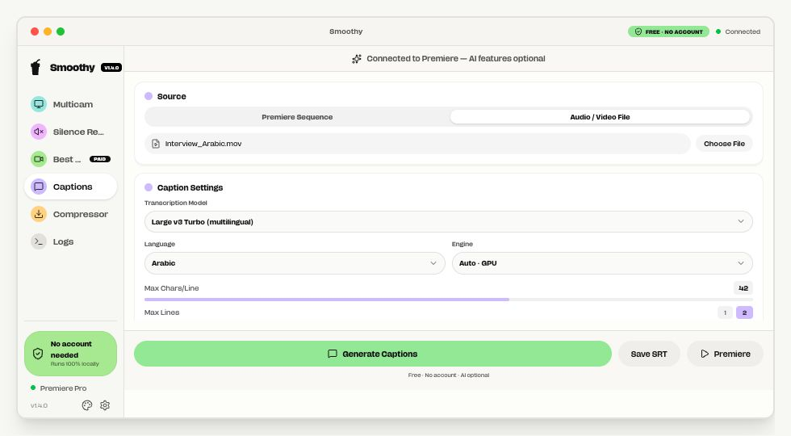
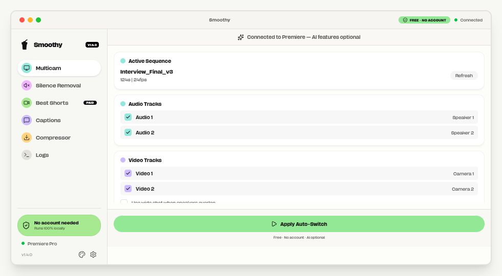

# SmoothyEdit

**Free local editing tools for Premiere Pro.** Switch multicam angles, cut silence, generate and edit multilingual captions, import SVGs and images, and compress video from one desktop app. The Premiere panel connects your timeline to SmoothyEdit; the core tools run on your computer.

[Download for Mac](https://smoothyedit.com/api/download/mac) · [Download for Windows](https://smoothyedit.com/api/download/win) · [See the latest release](https://github.com/alibahrawy/smoothyapp/releases/latest) · [Visit the website](https://smoothyedit.com/features/smoothy-app)

> **Current downloads:** macOS **1.5.0** for Apple Silicon is signed and notarized. Windows currently downloads **1.3.9** for x64. Both are available from the latest release.

## A look inside

These interface mockups show the SmoothyEdit 1.4 layout.

| Multilingual captions | Multicam editing |
| --- | --- |
|  |  |

## What it does

| Tool | Workflow |
| --- | --- |
| **Multicam** | Follow the active speaker and apply camera switches to a Premiere sequence. |
| **Silence removal** | Detect quiet sections and remove them from the timeline with adjustable settings. |
| **Captions** | Transcribe a Premiere sequence or an audio/video file locally. Choose a multilingual Whisper model and language, send captions to Premiere, or export an SRT. |
| **Assets** | Convert SVGs and images to PNGs, preserve transparency, export files, or send a still to Premiere. |
| **Compressor** | Reduce video file size with hardware encoding when available. |
| **Best Shorts** | Optional Studio feature that finds short-form moments and sends markers to Premiere. |

Premiere Pro connects through the bundled **CEP extension**. The desktop app installs or refreshes the panel when it starts. Premiere Pro 25.x and 26+ are supported. A DaVinci Resolve plugin is planned; you can already export an SRT from SmoothyEdit and [import it into Resolve](https://smoothyedit.com/blog/davinci-resolve-free-subtitles).

## Install

1. Download the installer for your platform from the links above.
2. Install and open SmoothyEdit. The Premiere panel is installed or refreshed automatically.
3. Open Premiere Pro and the **SmoothyEdit Bridge** panel, then work from your active sequence. Captions can also start from a local audio or video file.

The local tools do not require an account. Studio cloud features are optional.

After updating to 1.5, restart Premiere and reopen its SmoothyEdit panel. Sign in again to Studio to obtain the updated signed session.

## Repository layout

| Path | Contents |
| --- | --- |
| [`smoothyapp/`](smoothyapp/) | Electron desktop app and build configuration |
| [`smoothyapp-cep/`](smoothyapp-cep/) | Premiere Pro CEP panel and ExtendScript bridge |
| [`docs/images/`](docs/images/) | 1.4 interface mockups used in this README |

## Development

```bash
cd smoothyapp
npm install
npm run dev
```

To make local installers on the matching platform:

```bash
cd smoothyapp
npm run build:mac  # macOS Apple Silicon DMG + ZIP update package; signing/notarization needs your own Apple credentials
npm run build:win  # Windows x64 installer
```

Build configuration is in [`smoothyapp/package.json`](smoothyapp/package.json). Published downloads and release notes are in [GitHub Releases](https://github.com/alibahrawy/smoothyapp/releases).

The desktop app is licensed under [MIT](smoothyapp/LICENSE).
